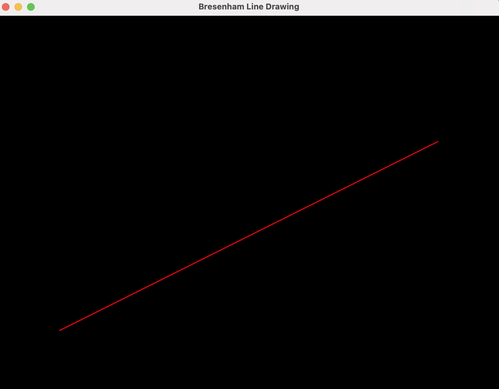
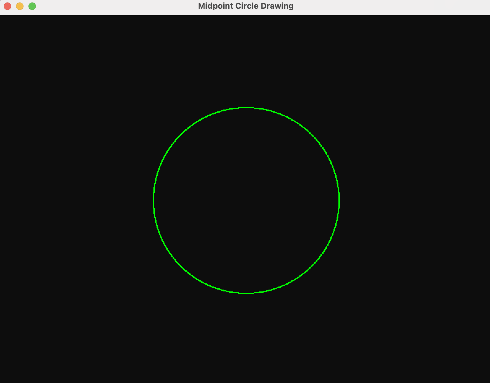
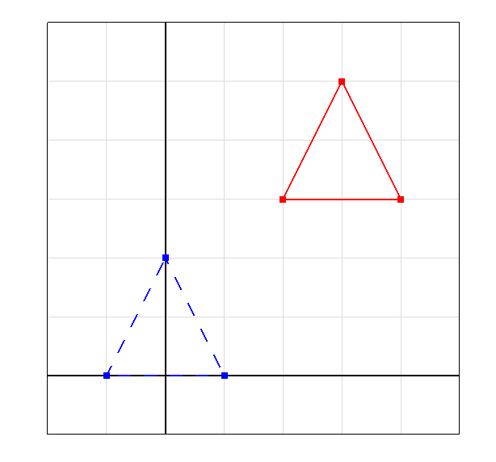
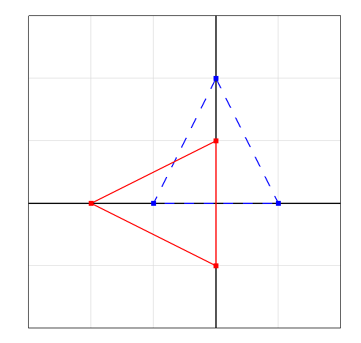
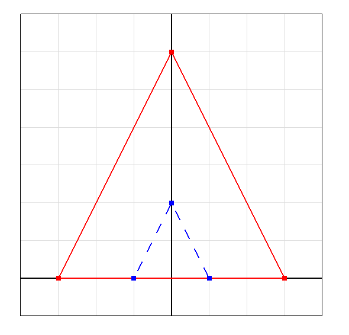
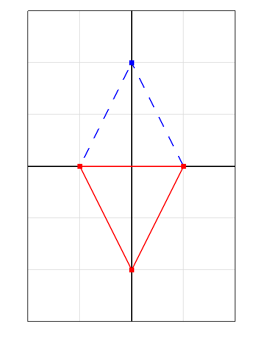

# Computer Graphics Lab

This repository contains implementations of computer graphics algorithms using **Python and PyOpenGL**.

## Lab Programs

### 1. Bresenham Line Drawing Algorithm

**Description:**
The Bresenham Line Drawing Algorithm is an incremental line rasterization algorithm that uses integer arithmetic to determine which pixels should be plotted to approximate a straight line.

**Implementation:**

[`Bresenham Line Drawing/main.py`](Bresenham_Line_Drawing/main.py)

**Output:**



---

### 2. Midpoint Circle Drawing Algorithm

**Description:**
The Midpoint Circle Drawing Algorithm uses a decision parameter to determine the closest pixels to the circumference of a circle. It calculates one octant of the circle and uses 8-way symmetry to generate the remaining points.

**Implementation:**

[`Midpoint Circle Drawing/main.py`](Midpoint_Circle_Drawing/main.py)

**Output:**



---

### 3. 2D Transformations Using Homogeneous Coordinates

**Description:**
Lab 3 demonstrates 2D geometric transformations using **3x3 homogeneous transformation matrices**. The program supports translation, rotation, scaling, and reflection. It displays the original shape with a dashed blue outline and the transformed shape with a solid red outline.

The sample shape uses three vertices:

* `(-1, 0)`
* `(1, 0)`
* `(0, 2)`

The number of vertices, vertex coordinates, transformation type, transformation values, rotation pivot, scaling fixed point, and reflection axis are all customizable through the program prompts.

**Implementation:**

[`Lab3/main.py`](Lab3/main.py)

**Outputs:**

#### Translation



#### Rotation



#### Scaling



#### Reflection



---

## Technologies Used

* Python
* PyOpenGL
* GLFW
* OpenGL


## How to Run

Install the required packages:

```bash
pip install PyOpenGL PyOpenGL_accelerate glfw
```

Then navigate to the required lab folder and run:

```bash
python main.py
```


