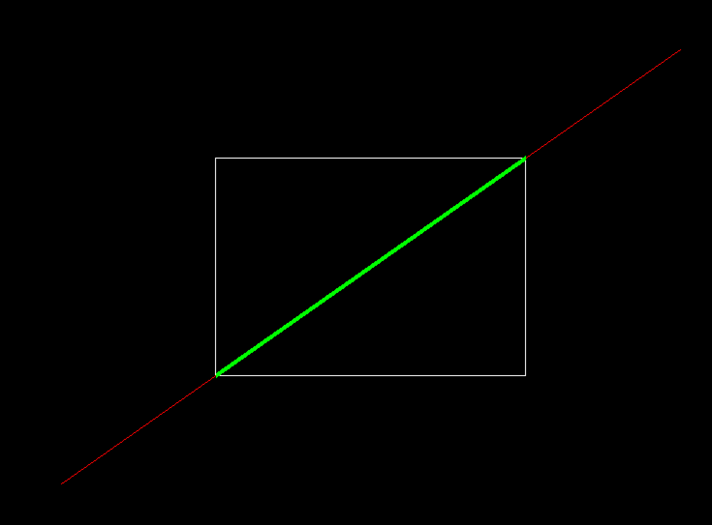

# Computer Graphics Lab

This repository contains implementations of computer graphics algorithms using **Python and PyOpenGL**.

## Lab Programs

### 1. Bresenham Line Drawing Algorithm

**Description:**
The Bresenham Line Drawing Algorithm is an incremental line rasterization algorithm that uses integer arithmetic to determine which pixels should be plotted to approximate a straight line.

**Implementation:**

[`Bresenham Line Drawing/main.py`](Bresenham_Line_Drawing/main.py)

**Output:**


---

### 2. Midpoint Circle Drawing Algorithm

**Description:**
The Midpoint Circle Drawing Algorithm uses a decision parameter to determine the closest pixels to the circumference of a circle. It calculates one octant of the circle and uses 8-way symmetry to generate the remaining points.

**Implementation:**

[`Midpoint Circle Drawing/main.py`](Midpoint_Circle_Drawing/main.py)

**Output:**


---

### 3. 2D Transformations Using Homogeneous Coordinates

**Description:**
Lab 3 demonstrates 2D geometric transformations using **3x3 homogeneous transformation matrices**. The program supports translation, rotation, scaling, and reflection. It displays the original shape with a dashed blue outline and the transformed shape with a solid red outline.

The sample shape uses three vertices:

* `(-1, 0)`
* `(1, 0)`
* `(0, 2)`

The number of vertices, vertex coordinates, transformation type, transformation values, rotation pivot, scaling fixed point, and reflection axis are all customizable through the program prompts.

**Implementation:**

[`Lab3/main.py`](Lab3/main.py)

**Outputs:**

#### Translation


#### Rotation


#### Scaling


#### Reflection


---

### 4. Composite 2D Transformations Using Matrix Representation

**Description:**
Lab 4 extends Lab 3 by chaining multiple 2D transformations (translation, rotation, scaling, and reflection) into a single **composite transformation matrix**. The program reads a custom shape, lets the user build a sequence of transformations, and applies them one after another, printing the intermediate coordinates at every stage. Each stage of the transformation is rendered on the graph so the full sequence from the original shape to the final result can be visualized.

**Implementation:**

[`Lab4/main.py`](Lab4/main.py)

**Output:**

<video src="https://raw.githubusercontent.com/neerajprao/CGVR/main/Lab4/Output/Lab4_Demo.mp4" controls width="600"></video>

> If the video above does not render, watch/download it directly: [`Lab4/Output/Lab4_Demo.mp4`](Lab4/Output/Lab4_Demo.mp4)

---

### 5. Cohen-Sutherland Line Clipping Algorithm

**Description:**
Lab 5 implements the **Cohen-Sutherland Line Clipping Algorithm**, which clips a line segment against a rectangular clipping window. Each endpoint is assigned a 4-bit region code (left, right, bottom, top) relative to the window, and the algorithm iteratively computes intersections with the window boundaries until the line is trivially accepted (fully inside) or trivially rejected (fully outside). The original line is drawn in red and the clipped portion inside the window is highlighted in green.

**Implementation:**

[`Lab5/cohen_sutherland.py`](Lab5/cohen_sutherland.py)

**Output:**



---

## Technologies Used

* Python
* PyOpenGL
* GLFW
* OpenGL


## How to Run

Install the required packages:

```bash
pip install PyOpenGL PyOpenGL_accelerate glfw
```

Then navigate to the required lab folder and run:

```bash
python main.py
```


